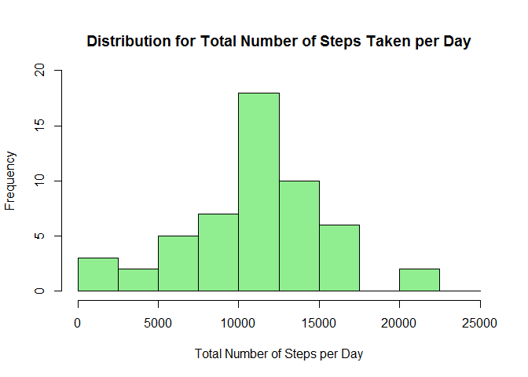
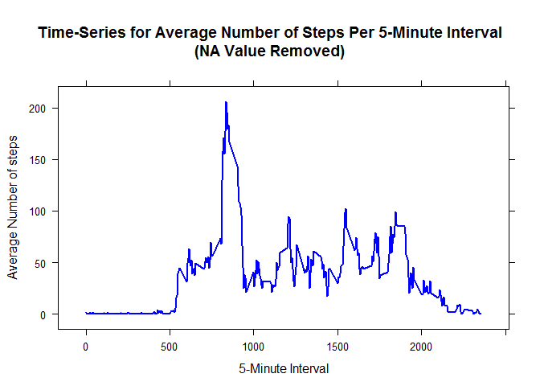
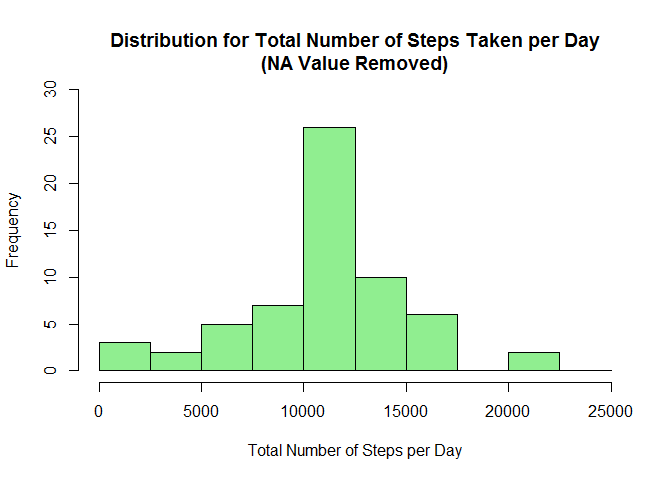
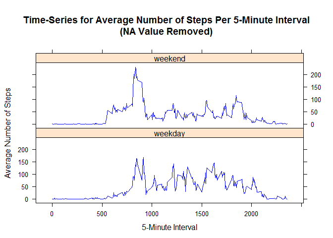

# Reproducible Research: Peer Assessment 1

##Introduction

It is now possible to collect a large amount of data about personal movement using activity monitoring devices such as a [Fitbit](http://www.fitbit.com), [Nike Fuelband](http://www.nike.com/us/en_us/c/nikeplus-fuel), or [Jawbone Up](https://jawbone.com/up).  These type of devices are part of the "quantified self" movement - a group of enthusiasts who take measurements about themselves regularly to improve their health, to find patterns in their behavior, or because they are tech geeks.  But these data remain under-utilized both because the raw data are hard to obtain and there is a lack of statistical methods and software for processing and interpreting the data.

This assignment makes use of data from a personal activity monitoring device.  This device collects data at 5 minute intervals through out the day.  The data consists of two months of data from an anonymous individual collected during the months of October and November, 2012 and include the number of steps taken in 5 minute intervals each day.

##Data

The data for this assignment can be downloaded from the course web site:

* Dataset: [Activity monitoring data](https://d396qusza40orc.cloudfront.net/repdata%2Fdata%2Factivity.zip) [52K]

The variables included in this dataset are:

* steps: Number of steps taking in a 5-minute interval (missing values are coded as NA)

* date: The date on which the measurement was taken in YYYY-MM-DD format

* interval: Identifier for the 5-minute interval in which measurement was taken

The dataset is stored in a comma-separated-value (CSV) file and there are a total of 17,568 observations in this dataset.
<BR><BR>

##Load Library
To begin with, let's load the neccessary library required for the analysis.

```r
library(data.table)
library(Hmisc)
library(knitr)
```

##Set Working Directory
Next I will proceed to setup the working directory in my Windows environment.

```r
setwd("C:\\Users\\Administrator\\Documents\\R Studio\\Reproducible Research\\Peer Assessment 1")
```

##Download and unzip the data into Data directory


```r
dataDownload <- "https://d396qusza40orc.cloudfront.net/repdata%2Fdata%2Factivity.zip"
zipName <- "repdata_data_activity.zip"

if(!file.exists(".\\Data\\repdata_data_activity.zip")) {
  temp <- tempfile()
  download.file(dataDownload, file.path(".\\Data", zipName))
  unzip(file.path(".\\Data", zipName), exdir = ".\\Data")
  unlink(temp)
  cat("Data successfully downloaded & extracted.")
} else {
  cat("Data already downloaded.")
}
```

------

##Loading and preprocessing the data

1. Loading the data (i.e. **`read.csv()`**)  

```r
fullData <- read.csv(".\\Data\\activity.csv", 
                     header = TRUE, 
                     sep = ",",
                     colClasses = c("numeric", "character", "numeric"))
```

2. Process/transform the data into a format suitable for the analysis

Converting the date field to **Date** class and interval field to **Factor** class.

```r
fullData$date <- as.Date(fullData$date, format = "%Y-%m-%d")
fullData$interval <- as.factor(fullData$interval)
```

------

##What is **`Mean`** Total Number of Steps Taken Per Day?

For this part of the analysis, I will ignore the missing values in the dataset.

1. Calculate the total number of steps taken per day

```r
totalStepsPerDay <- aggregate(x = list(totalSteps = fullData$steps), 
                       by = list(date = fullData$date), 
                       FUN = "sum")

head(totalStepsPerDay)
```

```
##         date totalSteps
## 1 2012-10-01         NA
## 2 2012-10-02        126
## 3 2012-10-03      11352
## 4 2012-10-04      12116
## 5 2012-10-05      13294
## 6 2012-10-06      15420
```

2. Make a histogram of the total number of steps taken each day

```r
hist(totalStepsPerDay$totalSteps,
     breaks = seq(from = 0, to = 25000, by = 2500),
     col = "LIGHTGREEN", 
     main = "\nDistribution for Total Number of Steps Taken per Day",
     xlab = "Total Number of Steps per Day", 
     ylim = c(0, 20))
```

 
    
3. Calculate and report the mean and median of the total number of steps taken per day

```r
meanStepsPerDay <- mean(totalStepsPerDay$totalSteps, na.rm = TRUE)
```

+ The mean of the total number of steps taken per day is **10766.189**.


```r
medianStepsPerDay <- median(totalStepsPerDay$totalSteps, na.rm = TRUE)
```

+ The median of the total number of steps taken per day is **10765**.  

------

##What is the Average Daily Activity Pattern?

1. Calculate average steps for each interval for all days

```r
avgStepsPerInterval <- aggregate(x = list(avgSteps = fullData$steps), 
                      by = list(interval = fullData$interval), 
                      FUN = mean, 
                      na.rm = TRUE)
```

2. Converting **`Interval`** field to **`Integers`** class assist in plotting

```r
avgStepsPerInterval$interval <- as.integer(levels(avgStepsPerInterval$interval)[avgStepsPerInterval$interval])
```

3. Create a time series plot of the 5-minute interval (x-axis) and the average number of steps taken, averaged across all days (y-axis)

```r
xyplot(avgSteps ~ interval, avgStepsPerInterval, 
       type = "l", 
       col = "BLUE",
       lwd = 2, 
       main = "\nTime-Series for Average Number of Steps Per 5-Minute Interval\n(NA Value Removed)",
       xlab = "5-Minute Interval", 
       ylab = "Average Number of steps")
```

 

4. Identify which 5-minute interval, on average across all the days in the dataset, contains the maximum number of steps?

```r
mostStepsPosition <- which.max(avgStepsPerInterval$avgSteps)
maxInterval <- gsub("([0-9]{1,2})([0-9]{2})", 
                    "\\1:\\2", 
                    avgStepsPerInterval[mostStepsPosition,"interval"])
maxAvgSteps <- avgStepsPerInterval[mostStepsPosition,"avgSteps"]
```

* The maximum number of steps of **206.17** is recorded at **8:35**.

------

##Imputing missing values

Note that there are a number of days/intervals where there are missing values (coded as NA).  The presence of missing days may introduce bias into some calculations or summaries of the data.

1. Calculate and report the total number of missing values in the dataset (i.e. the total number of rows with NAs)

```r
totalNA <- length(which(is.na(fullData$steps)))
```
+ The total number of missing values in the dataset is **2304**.

2. The strategy adopted for filling in all of the missing values in the dataset is to use the **`mean`** for that 5-minute interval to fill each **`NA`** value in the steps column.

3. Create a new dataset that is equal to the original dataset but with the missing data filled in.

```r
fullDataModified <- fullData
```

4. Use the **`mean`** for that 5-minute interval to fill each **`NA`** value in the steps column in the new dataset

```r
for (x in 1:nrow(fullDataModified)) {
  if (is.na(fullDataModified$steps[x])) {
    fullDataModified$steps[x] <- avgStepsPerInterval[which(fullDataModified$interval[x] == avgStepsPerInterval$interval), ]$avgSteps
  }
}
```

5. Calculate the total number of steps taken per day using the new dataset with the missing values flled in

```r
totalStepsPerDayModified <- aggregate(x = list(totalSteps = fullDataModified$steps), 
                                      by = list(date = fullDataModified$date), 
                                      FUN = "sum")
```

6. Create a histogram of the total number of steps taken each day

```r
hist(totalStepsPerDayModified$totalSteps,
     breaks = seq(from = 0, to = 25000, by = 2500),
     col = "LIGHTGREEN", 
     main = "\nDistribution for Total Number of Steps Taken per Day\n(NA Value Removed)",
     xlab = "Total Number of Steps per Day", 
     ylim = c(0, 30))
```

 

7. Calculate and report the mean total number of steps taken per day

```r
meanStepsPerDayModified <- mean(totalStepsPerDayModified$totalSteps, na.rm = TRUE)
```
After filling in all of the missing values in the dataset, the mean of the total number of steps taken per day is **10766.189**.

8. Calculate and report the median total number of steps taken per day

```r
medianStepsPerDayModified <- median(totalStepsPerDayModified$totalSteps, na.rm = TRUE)
```
After filling in all of the missing values in the dataset, the median of the total number of steps taken per day is **10766.189**.

9. Take a look at the comparsion table below, which shows the values before and after imputed:

Statistical Function    Before Imputed   After Imputed
---------------------  ---------------  --------------
Mean                          10766.19        10766.19
Median                        10765.00        10766.19

10. What is the impact of imputing missing data on the estimates of the total daily number of steps?
+ The impact of imputing the missing values is to have more data for analysis, which have affected the result of the **`median`** value.

------

##Are there Differences in Activity Patterns Between Weekdays and Weekends?

I will use the dataset with the filled-in missing values for this part of the analysis.

1. Create a new factor variable in the dataset with two levels - "weekday" and "weekend" indicating whether a given date is a weekday or weekend day.

```r
fullDataModified$dateType <- ifelse(as.POSIXlt(fullDataModified$date)$wday %in% c(0, 6), 
                                    'weekday', 
                                    'weekend')
```

2. Create a panel plot containing a time series plot of the 5-minute interval (x-axis) and the average number of steps taken, averaged across all weekday days or weekend days (y-axis). 

```r
dataByDayOfWeek <- aggregate(x = list(avgSteps = fullDataModified$steps), 
                             by = list(interval = fullDataModified$interval, 
                                       DayOfWeek = fullDataModified$dateType), 
                             FUN = "mean")

dataByDayOfWeek$interval <- as.integer(levels(dataByDayOfWeek$interval)[dataByDayOfWeek$interval])

xyplot(avgSteps ~ interval | DayOfWeek, dataByDayOfWeek, 
       type = "l", 
       col = "BLUE",
       lwd = 1, 
       main = "\nTime-Series for Average Number of Steps Per 5-Minute Interval\n(NA Value Removed)",
       xlab = "5-Minute Interval", 
       ylab = "Average Number of Steps", 
       layout = c(1, 2))
```

 

The observation from the chart above shows that more activities are recorded on Weekday than Weekends, despite the highest peak recorded is found on weekends.
